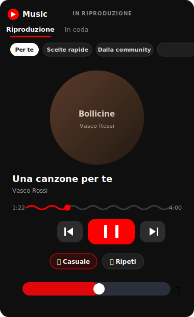
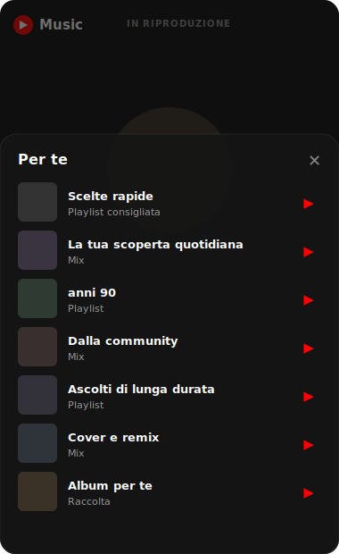

# YTMusic Card

A YouTube-Music-styled "now playing" card that works with **both** the [YTube_Media_Player integration](https://github.com/KoljaWindeler/ytube_music_player) **and [Music Assistant](https://www.music-assistant.io/)** — the card **auto-detects** which one the entity belongs to and adapts accordingly.

The **YTMusic Playing Card** is a full "now playing" player with a YouTube-Music look: an undulating cover that breathes while playing, a wavy animated progress bar, big red transport controls, shuffle/repeat, a volume pill, and quick-access **category chips** that open a translucent popup with that category's music, plus a **search** with type filters.

<p align="center">
  
  &nbsp;&nbsp;
  
</p>

## Compatibility

The card **auto-detects** the media player type from the entity and adapts:

- **YouTube Music** (`ytube_music_player`): now-playing player, curated category chips (For You / Quick picks / From the community / Radio / Playlists / Recent), search with type filters, and the play **queue**.
- **Music Assistant** (`app_id: music_assistant`): now-playing player, the **full play queue** (reorder / play-next / remove), native MA **search** (`music_assistant.search`), an **Add/Play menu** (play now / next / add to queue / play radio) on every result, an advanced **browser** (Recommendations & Discover, Recent, Library by type — shown as a cover grid), a **multi-room players** panel (group/ungroup speakers and per-speaker volume), and a **queue options** menu (transfer the queue to another player, clear the queue). On YouTube Music the queue menu offers **turn off** instead.

Just point `entity_id` at either a `ytube_music_player` entity or a Music Assistant `media_player` entity.

### Music Assistant — required integration

The advanced Music Assistant features (full queue, queue actions, Discover/recommendations) rely on the companion integration **[Music Assistant Queue Actions (`mass_queue`)](https://github.com/droans/mass_queue)**. Install it via HACS and create a config entry for your MA instance. Without it, the card still works but the Music Assistant queue falls back to showing only the current + next track.


## Installation

### HACS

1. Open the HACS section of Home Assistant.
2. Click the "..." button in the top right corner and select "Custom Repositories."
3. In the window that opens paste this Github URL ([https://github.com/cash83/ytmusic-card]).
4. Select "Lovelace"
5. In the window that opens when you select it click om "Install This Repository in HACS"

### Manually

1. Copy `ytmusic-card.js` into your `<config>/<www>` folder
2. Add `ytmusic-card.js` as a dashboard resource.

## YTMusic-Playing-Card

The full "now playing" experience for ytube_music_player: current track with an undulating cover, wavy progress bar, transport controls, shuffle/repeat and volume — plus category chips that open a popup to jump into your suggestions and library.

A **visual editor** is included, so all options below can be set with switches/fields — no YAML required.

### Settings

| Option | Default | Description |
| --- | --- | --- |
| `entity_id` | – | a `ytube_music_player` **or** a Music Assistant `media_player` entity (auto-detected). Required. |
| `header` | `YouTube Music` | title of the card |
| `speakers` | *(all)* | list of `media_player` entities to show in the Players panel / source selector. Empty = all available Music Assistant players. |
| `show_search` | `true` | show the search button |
| `show_queue` | `true` | show the "Queue" tab |
| `queue_actions` | `true` | show move/remove buttons on queue items (Music Assistant) |
| `enqueue_menu` | `true` | show the Add/Play (⋮) menu on search & browse items (Music Assistant) |
| `media_browser` | `true` | show the advanced browse chips (Recommendations / Recent / Library) |
| `players` | `true` | show the multi-room Players panel (Music Assistant) |
| `show_chips` | `true` | show the category chips row |
| `cover_animation` | `true` | undulating "breathing" cover while playing |
| `cover_glow` | `true` | animated colored halo behind the cover |
| `anim_speed` | `6` | cover animation duration in seconds (higher = slower) |
| `glow_size` | `100` | halo size, in percent |

### Example

```yaml
type: custom:ytmusic-playing-card
entity_id: media_player.youtube_living_room_display
header: YouTube Music
```


## YTMusic-Search-Card

Search YouTube Music directly from your dashboard.

### Settings

-   `entity_id` - a YTube_Media_Player entity

### Example

```yaml
type: custom:ytmusic-search-card
entity_id: media_player.youtube_living_room_display
```
